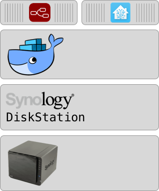
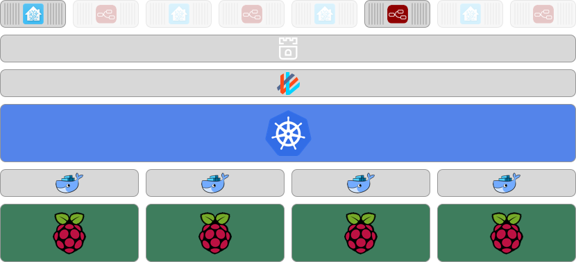

During the last month, there’s been a lot of changes to my life. I started a new job at Lunar Way, and not least I became a dad for the 3rd time, this time to a little boy.

Big things!!… this piece is however about how I’m trying to build a reliable home automation setup using kubernetes, raspberry pi’s, home assistant, node red, IHC, hue bulbs, Ring doorbell and much more.

By starting at Lunar Way I became a colleague with [Kasper Nissen](undefined) which, during one of the geek chats, told me about his (and another colleague, [Martin Jensen](undefined)’s) project [kubecloud.io](http://kubecloud.io). In the essence, they build a small cloud of Raspberry Pi’s and installed kubernetes on them. The idea resonated with me and it made me want to replicate it. Not only because I love playing with kubernetes and want my own k8s cloud at home to geek with, but rather that I’ve got a running home automation system which could use some high availability improvements.

## Ground Zero

So let’s start with where I am today:

A Synology server running Synology DiskStation with Docker installed as a plugin. On top of that I run 2 docker containers:

* [home assistant](https://www.home-assistant.io/docs/installation/docker/)

* [node-red](https://hub.docker.com/r/nodered/node-red-docker/)

The setup is running alright, but now and then my Synology server seems to run low on system resources. This requires either a full server reboot or rebooting docker images and waiting for them to come up again. Not only is this a manual task, but it also leaves some downtime where no buttons in my house are working.

## Just getting started

A way to *stabilize* my home automation is to make it faster to recover. That means that I need a server to take over when one becomes unavailable. This is where the kubernetes cluster comes in. Even though I been using kubernetes for quite some time I first started considering a full blown cluster when I became knowledgeable about [Kasper](undefined)’s work on using Raspberry Pi’s + kubernetes. The idea of using k8s and Pi’s fits well to my project because:

* Raspberry Pi’s are as cheap as it gets, meaning I can have more units.

* The new Model 3 B+ have both a Quad Core CPU and 1GB of RAM meaning I got processing power enough

* Kasper (and some others) have already made a good deal of work on running kubernetes on Raspberry Pi’s, meaning I can focus on making it work for home automation.

To get started I ordered 4 new Raspberry Pi Model 3 B+’s and 4 64GB MicroSD cards. I also went through my old equipment and found a switch, ethernet & microusb cables + some usb power supplies and a power strip.

*My h2e Raspberry Pi setup*

Since I, at the moment, use a lot of “recycled” equipment my setup look a bit messy and DIY, but I guess that will evolve over time. For now it does what it needs to do.

To get the Pi’s running I’ve been working on my take on a minimalistic Ansible script, but otherwise you could also get going using the great and recently updated [blog post](https://kubecloud.io/setting-up-a-kubernetes-1-11-raspberry-pi-cluster-using-kubeadm-952bbda329c8) by [Kasper](undefined). *I’ll add my link on how to use a minimalistic Ansible setup later.*

So now I have the Raspberry Pi’s running. I’ve named the cluster h2e.

The idea is that the new setup should look like this:

* The Raspberry Pi’s running Raspbian

* Docker CE on top of the nodes

* Kubeadm spawned kubernetes cluster — multi master, but with masters doing worker work

* Weave network overlay — wanted to try out Cilium, but it is [not ready for ARM](https://github.com/cilium/cilium/issues/1104)

* Rook.io to supply storage — for making distributed shared volumes for home-assistant and node-red

* home-assistant & node-red containers — potentially running on any of the nodes, but only one instance at the time for now

With a cluster with the above mentioned specs I should be able to run my home automations pretty reliable. It would be better to run multiple instances of home-assistant & node-red, so there would be no downtime, but from what I’ve been reading until now, this isn’t possible in any near future.

## Coming up

I will split this project into several blog posts on the different subjects:

* Setting up a Raspberry Pi kubernetes cluster using a minimalistic ansible playbook — *planned*

* Playing with rook.io on a Raspberry Pi kubernetes cluster — *planned*

* Running home-assistant and node-red on kubernetes — *planned*
